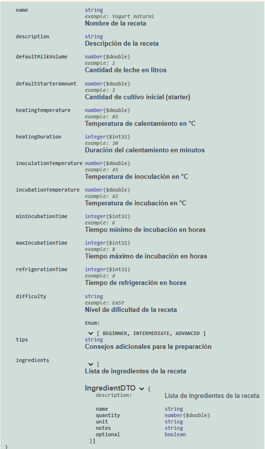
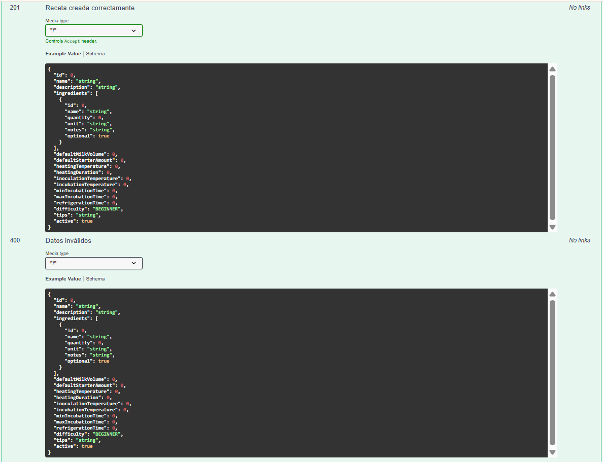
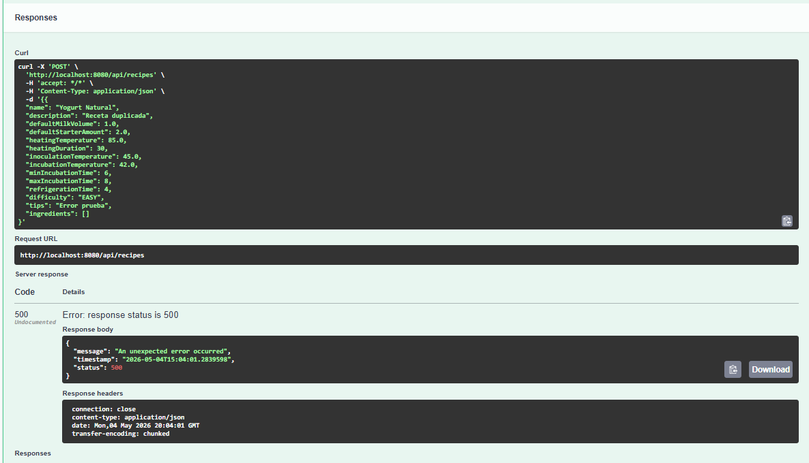

# RecipeYogurt API 🍓

API REST desarrollada con Spring Boot para gestionar recetas de yogurt de manera sencilla.
El proyecto permite crear, consultar, actualizar y administrar recetas usando endpoints HTTP y documentación Swagger.

---

# Tecnologías utilizadas

* Java 21
* Spring Boot 3
* Spring Data JPA
* H2 Database
* Swagger OpenAPI 3
* Maven

---

# Funciones principales

* Crear recetas
* Consultar recetas
* Actualizar recetas
* Activar recetas
* Desactivar recetas

---

# Cómo ejecutar el proyecto

## Requisitos

* Java 21
* Maven

## Ejecutar

```bash
./mvnw spring-boot:run
```

---

# Swagger OpenAPI

La documentación Swagger se encuentra disponible en:

```txt
http://localhost:8080/swagger-ui/index.html
```

Desde Swagger puedes probar todos los endpoints directamente desde el navegador.

---

# Endpoints principales

| Método | Endpoint                     | Descripción       |
| ------ | ---------------------------- | ----------------- |
| POST   | /api/recipes                 | Crear receta      |
| GET    | /api/recipes                 | Listar recetas    |
| GET    | /api/recipes/{id}            | Obtener receta    |
| PUT    | /api/recipes/{id}            | Actualizar receta |
| PATCH  | /api/recipes/{id}/activate   | Activar receta    |
| PATCH  | /api/recipes/{id}/deactivate | Desactivar receta |

---

# Ejemplo JSON

```json
{
  "name": "Yogurt con frutas",
  "description": "Receta saludable",
  "ingredients": [
    "Yogurt",
    "Fresas",
    "Banano"
  ]
}
```

---

# Evidencias

El proyecto incluye:

* Documentación OpenAPI (`openapi.json`)
* Capturas de Swagger
* Manejo de errores
* Evidencias de pruebas

---

# Capturas Swagger

## Modelo de datos (Schema)

<p align="center">
  
</p>

## Prueba exitosa (201 Created)

<p align="center">
  
</p>

## Manejo de errores (400 / 500)

<p align="center">
  
</p>

---

# Pruebas realizadas

* Creación de recetas
* Consulta de recetas
* Actualización de recetas
* Activación y desactivación
* Manejo de errores HTTP

---

# Autor

Juan Sebastian Orrego Lopera

---

# Licencia

Este proyecto utiliza la licencia MIT.
